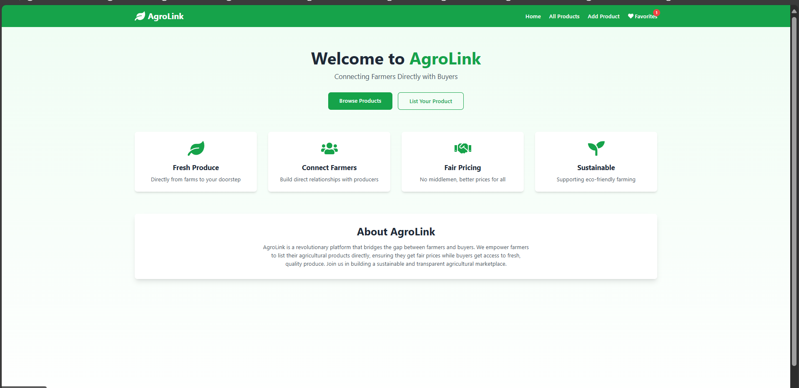
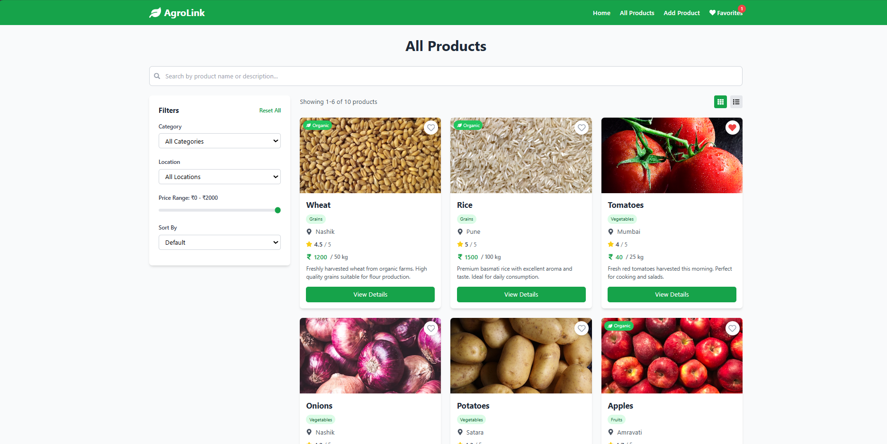
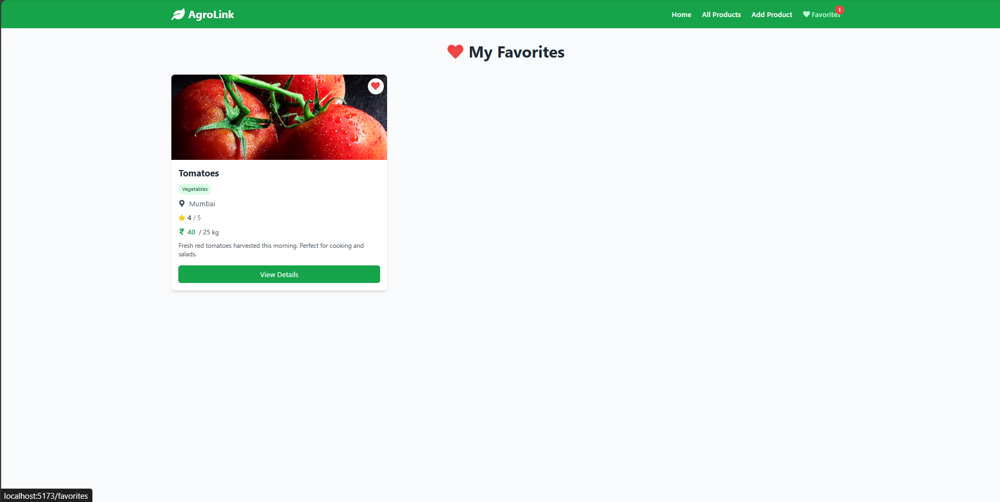

# AgroLink - Advanced Frontend CRUD Application

AgroLink is a feature-rich React + Tailwind CSS frontend application with full CRUD functionality using Axios and JSON-Server. It allows farmers to list, update, and manage agricultural products while providing buyers with advanced search, filtering, and discovery features through a responsive, modern UI.

## 📸 Screenshots

### Home Page
![Home Page] 
*Landing page with platform overview and features*

### All Products - Advanced Search & Filter
![All Products] 
*Product listing with search bar, filters (category, location, price range), sorting, pagination, and grid/list view toggle*

### Favorites Page
![Favorites] 
*Saved favorite products with persistent storage*

## 🚀 Features

### Core Features
- ✅ **Full CRUD Operations** - Create, Read, Update, and Delete agricultural products
- 🎨 **Responsive UI** - Built with Tailwind CSS for a modern, mobile-friendly design
- 🔄 **React Router DOM** - Multi-page navigation with clean routing
- 📡 **Axios Integration** - Seamless API communication with JSON-Server
- 🔔 **Toast Notifications** - User feedback with React Toastify
- 🎯 **Reusable Components** - Modular component architecture

### Buyer Features
- 🔐 **Authentication System** - Login/Register with role selection (Buyer/Farmer)
- 👤 **Buyer Dashboard** - Personalized dashboard with order stats and cart summary
- 🛒 **Shopping Cart** - Full cart functionality with quantity management
- 💳 **Checkout Process** - Complete order placement with address management
- 📦 **Order Management** - View order history with status tracking
- 👨‍💼 **Profile Management** - Update buyer profile information
- 🔒 **Protected Routes** - Secure buyer-only pages

### Farmer Features
- 🔐 **Farmer Authentication** - Login/Register as farmer with farm details
- 👨‍🌾 **Farmer Dashboard** - Dedicated dashboard with farm statistics
- 📊 **Product Management** - View all farmer's products in one place
- 📈 **Farm Analytics** - Track total products, stock status, ratings, organic count
- ➕ **Quick Add Product** - Direct access to add new products
- ✏️ **Edit Products** - Manage and update product listings
- 🏆 **Certification Display** - Show farm certification status

### Advanced Features
- 🔍 **Advanced Search** - Search products by name or description
- 🎚️ **Smart Filtering** - Filter by category, location, and price range
- 📊 **Multi-Sort Options** - Sort by price, name, or rating
- 📄 **Pagination** - Efficient browsing with 6 items per page
- ❤️ **Favorites/Wishlist** - Save favorite products (localStorage)
- ⭐ **Product Ratings** - Display product ratings and reviews
- 🏷️ **Category System** - Organized product categories (Grains, Vegetables, Fruits, Dairy)
- 👨‍🌾 **Farmer Profiles** - Dedicated farmer pages with contact information
- 🌿 **Organic Badges** - Visual indicators for organic products
- 📦 **Stock Status** - Real-time stock availability indicators
- 🎯 **Grid/List View** - Toggle between viewing modes
- 🔢 **Live Counters** - Real-time cart and favorites count in navigation

## 📁 Project Structure

```
agrolink/
│── src/
│   ├── components/
│   │   ├── Navbar.jsx
│   │   ├── ProductCard.jsx
│   │   ├── Button.jsx
│   │   ├── Modal.jsx
│   │   ├── SearchBar.jsx
│   │   ├── FilterPanel.jsx
│   │   └── Pagination.jsx
│   ├── context/
│   │   ├── AuthContext.jsx
│   │   └── CartContext.jsx
│   ├── pages/
│   │   ├── Home.jsx
│   │   ├── AllProducts.jsx
│   │   ├── AddProduct.jsx
│   │   ├── EditProduct.jsx
│   │   ├── ProductDetails.jsx
│   │   ├── Favorites.jsx
│   │   ├── FarmerProfile.jsx
│   │   ├── Login.jsx
│   │   ├── BuyerDashboard.jsx
│   │   ├── Cart.jsx
│   │   ├── Checkout.jsx
│   │   ├── MyOrders.jsx
│   │   └── Profile.jsx
│   ├── services/
│   │   └── api.js
│   ├── App.jsx
│   ├── main.jsx
│   └── index.css
│── db.json
│── package.json
│── tailwind.config.js
└── README.md
```

## 🛠️ Technologies Used

- **React** - UI library
- **Vite** - Build tool and dev server
- **React Router DOM** - Routing and navigation
- **Tailwind CSS** - Utility-first CSS framework
- **Axios** - HTTP client for API calls
- **JSON-Server** - Mock REST API
- **React Icons** - Icon library
- **React Toastify** - Notification system

## 📋 Prerequisites

- Node.js (v14 or higher)
- npm or yarn package manager

## ⚙️ Installation & Setup

1. **Navigate to project directory**
   ```bash
   cd agrolink
   ```

2. **Install dependencies** (already done)
   ```bash
   npm install
   ```

## 🚀 Running the Application

You need to run **TWO separate terminals**:

### Terminal 1: Start JSON-Server (Backend)

```bash
npm run server
```

This will start the JSON-Server on `http://localhost:3001`

### Terminal 2: Start React App (Frontend)

```bash
npm run dev
```

This will start the Vite development server. Open your browser and navigate to the URL shown in the terminal (typically `http://localhost:5173`)

## 🌐 Available Routes

### Public Routes
- `/` - Home page with platform overview
- `/products` - View all agricultural products with search & filter
- `/product/:id` - View detailed information about a product
- `/farmer/:id` - View farmer profile and their products
- `/login` - Login or register as a buyer

### Buyer Routes (Authentication Required)
- `/buyer-dashboard` - Buyer dashboard with stats and quick actions
- `/cart` - Shopping cart with quantity management
- `/checkout` - Checkout page for order placement
- `/my-orders` - Order history and tracking
- `/profile` - Update buyer profile information
- `/favorites` - View saved favorite products

### Farmer Routes (Authentication Required)
- `/farmer-dashboard` - Farmer dashboard with farm stats and product management
- `/add-product` - Form to add new product
- `/edit-product/:id` - Form to edit existing product

## 📡 API Endpoints

The JSON-Server provides the following endpoints:

**Products:**
- `GET http://localhost:3001/products` - Fetch all products
- `GET http://localhost:3001/products/:id` - Fetch single product
- `POST http://localhost:3001/products` - Add new product
- `PUT http://localhost:3001/products/:id` - Update product
- `DELETE http://localhost:3001/products/:id` - Delete product

**Categories:**
- `GET http://localhost:3001/categories` - Fetch all categories

**Farmers:**
- `GET http://localhost:3001/farmers` - Fetch all farmers
- `GET http://localhost:3001/farmers/:id` - Fetch single farmer

**Buyers (Authentication):**
- `GET http://localhost:3001/buyers` - Fetch all buyers
- `GET http://localhost:3001/buyers/:id` - Fetch single buyer
- `POST http://localhost:3001/buyers` - Register new buyer
- `PUT http://localhost:3001/buyers/:id` - Update buyer profile

**Orders:**
- `GET http://localhost:3001/orders` - Fetch all orders
- `GET http://localhost:3001/orders?buyerId=:id` - Fetch buyer's orders
- `POST http://localhost:3001/orders` - Create new order
- `PATCH http://localhost:3001/orders/:id` - Update order status

## 📊 Database Schema

**Products:**
```json
{
  "id": "1",
  "name": "Wheat",
  "price": 1200,
  "quantity": "50 kg",
  "location": "Nashik",
  "category": "Grains",
  "farmerId": "1",
  "image": "image_url",
  "description": "Product description",
  "rating": 4.5,
  "inStock": true,
  "organic": true
}
```

**Categories:**
```json
{
  "id": "1",
  "name": "Grains",
  "icon": "🌾",
  "description": "Wheat, Rice, and other grains"
}
```

**Farmers:**
```json
{
  "id": "1",
  "name": "Ramesh Patil",
  "location": "Nashik",
  "phone": "+91 9876543210",
  "email": "ramesh.patil@example.com",
  "password": "farmer123",
  "farmSize": "10 acres",
  "certified": true,
  "specialization": "Organic Farming",
  "avatar": "avatar_url"
}
```

**Buyers:**
```json
{
  "id": "1",
  "name": "Rajesh Mehta",
  "email": "rajesh@example.com",
  "password": "buyer123",
  "phone": "+91 9988776655",
  "address": "123 MG Road, Mumbai",
  "avatar": "avatar_url",
  "createdAt": "2025-01-15"
}
```

**Orders:**
```json
{
  "id": "1",
  "buyerId": "1",
  "items": [
    {
      "productId": "1",
      "productName": "Wheat",
      "quantity": 2,
      "price": 1200,
      "total": 2400
    }
  ],
  "totalAmount": 2400,
  "status": "delivered",
  "orderDate": "2025-03-01",
  "deliveryDate": "2025-03-05",
  "shippingAddress": "123 MG Road, Mumbai"
}
```

## 🎨 Key Components

### Context Providers
- **AuthContext** - Global authentication state management
- **CartContext** - Shopping cart state with localStorage persistence

### Reusable Components
- **Navbar** - Navigation bar with cart counter, favorites counter, and user authentication
- **ProductCard** - Enhanced product card with ratings, badges, favorite toggle, and add to cart
- **Button** - Customizable button with multiple variants
- **Modal** - Reusable modal for confirmations
- **SearchBar** - Search input with icon
- **FilterPanel** - Advanced filtering sidebar
- **Pagination** - Page navigation component

### Pages
- **Home** - Landing page with features and about section
- **AllProducts** - Advanced product listing with search, filter, sort, and pagination
- **AddProduct** - Comprehensive form to create new product listing
- **EditProduct** - Form to update existing product
- **ProductDetails** - Full product information with farmer details, add to cart, and actions
- **Favorites** - Saved favorite products page
- **FarmerProfile** - Farmer information and their products
- **Login** - Authentication page (Login/Register with role selection)
- **BuyerDashboard** - Buyer dashboard with stats and quick actions
- **FarmerDashboard** - Farmer dashboard with farm stats and product management
- **Cart** - Shopping cart with quantity management
- **Checkout** - Order placement with address confirmation
- **MyOrders** - Order history with status tracking
- **Profile** - Buyer profile management

## 🎯 CRUD Operations

### Farmer Operations

#### Create (Add Product)
- Navigate to "Add Product" page
- Fill in product details (name, price, category, farmer, etc.)
- Submit form to add to database

#### Read (View Products)
- Browse all products on "All Products" page with search & filters
- Click "View Details" to see full information

#### Update (Edit Product)
- Click "Edit" button on product details page
- Modify product information
- Save changes to update database

#### Delete (Remove Product)
- Click "Delete" button on product details page
- Confirm deletion in modal
- Product removed from database

### Buyer Operations

#### Authentication
- **Register**: Create new account with role selection (Buyer or Farmer)
  - **Buyer**: Provide name, email, password, phone, delivery address
  - **Farmer**: Provide name, email, password, phone, farm location
- **Login**: Authenticate with email and password (works for both buyers and farmers)
- **Demo Accounts**: 
  - Buyer: `rajesh@example.com` / `buyer123`
  - Farmer: `ramesh.patil@example.com` / `farmer123`

#### Shopping
- **Browse Products**: View all products with search and filters
- **Add to Cart**: Add products with quantity selection
- **Manage Cart**: Update quantities or remove items
- **Checkout**: Place order with delivery address
- **Order Tracking**: View order history and status

#### Profile Management
- **View Profile**: See account information
- **Edit Profile**: Update name, phone, and address
- **Logout**: End session and clear cart

## 🎨 Styling

The application uses **Tailwind CSS** for styling with:
- Responsive grid layouts
- Custom color scheme (Green theme for agricultural focus)
- Hover effects and transitions
- Shadow and rounded corners
- Mobile-first responsive design

## 📱 Responsive Design

The application is fully responsive and works seamlessly on:
- 📱 Mobile devices
- 📱 Tablets
- 💻 Desktop computers

## 🔧 Build for Production

```bash
npm run build
```

This creates an optimized production build in the `dist` folder.

## 📝 Notes

- Make sure JSON-Server is running before using the application
- The database file `db.json` will be automatically updated with changes
- Images are stored as URLs (external links)
- **Authentication**: Uses simple email/password with JSON-Server (for demo purposes)
- **Roles**: Two user types - Buyers and Farmers (selected during registration)
- **Cart & Favorites**: Stored in localStorage for persistence
- **Demo Accounts**: 
  - **Buyer**: `rajesh@example.com` / `buyer123`
  - **Farmer**: `ramesh.patil@example.com` / `farmer123`

## 🔐 Authentication Flow

1. **Registration**: 
   - Choose role: Buyer or Farmer
   - Enter details based on role
   - Buyers: delivery address
   - Farmers: farm location
2. **Login**: Existing users login with email and password
3. **Session Management**: User data stored in localStorage with role
4. **Protected Routes**: 
   - Buyer dashboard, cart, checkout, orders require buyer authentication
   - Farmer dashboard, add/edit product require farmer authentication
5. **Logout**: Clears user session and cart data

## 🛒 Shopping Flow

1. **Browse Products**: Search, filter, and sort products
2. **Add to Cart**: Click cart icon on product cards or use quantity selector on details page
3. **View Cart**: See all items with quantity management
4. **Checkout**: Login (if not authenticated) and confirm delivery address
5. **Place Order**: Order saved to database with "pending" status
6. **Track Orders**: View order history in "My Orders" page

## 🤝 Contributing

This is a learning project demonstrating CRUD operations with React and JSON-Server.

## 📄 License

This project is open source and available for educational purposes.

## 👨‍💻 Author

Created as a frontend CRUD demonstration project for AgroLink platform.

---

**Happy Coding! 🌾**

